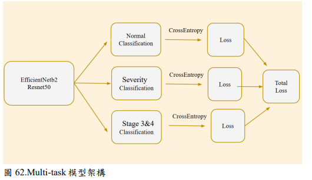
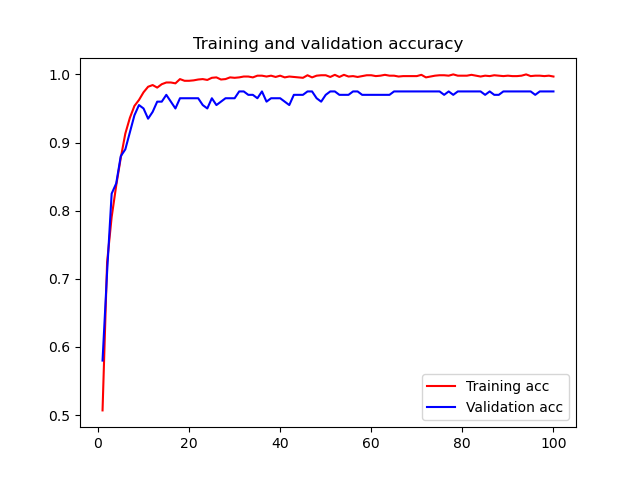
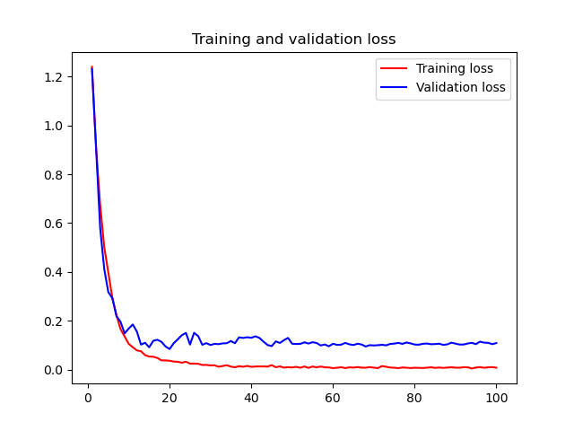
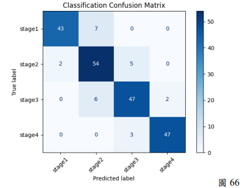

# Pressure-Ulcer-Classification
運用深度學習進行壓瘡傷口影像分級與分析 (Pressure Ulcer Classification using Deep Learning)
以深度學習分析壓瘡影像，探討不同分類方法在 Stage 1～4 分級上的表現。

## Overview

**研究流程：**
`General Classification` ➔ `Image Reconstruction` ➔ `Ordinal Classification` ➔ `Multi-task Learning` ➔ `Feature Visualization` ➔ `Model Pruning`

| 研究階段 | 核心技術 | 對應程式碼 (Notebook) |
| :--- | :--- | :--- |
| **1. 基礎分類** | 比較 EfficientNet 與 ResNet 在壓瘡分級的表現 | [`efficientnet-pytorch.ipynb`](./efficientnet-pytorch.ipynb) |
| **2. 影像重建** | 使用 Real-ESRGAN 強化傷口特徵 | [`real-esrgan.ipynb`](./real-esrgan.ipynb) |
| **3. 序列分類** | 引入 Ordinal Classification | [`ordinal-classification.ipynb`](./ordinal-classification.ipynb) |
| **4. 多任務學習** | **(最終最佳模型)** 將分類任務拆解共同學習 | [`multi-task-learning.ipynb`](./multi-task-learning.ipynb) |

 [**專題海報：**](./project_poster)

## 專題簡介

在傷口影像辨識中，不同類型的傷口通常有較明顯的差異，但如果是同一類型、不同嚴重程度的傷口，彼此之間的外觀差異可能非常細微。

因此，我們將研究方向放在壓瘡（Pressure Ulcer）分級，希望透過深度學習模型分析傷口影像，找出較適合用於 Stage 1～4 分級的方法。

本專題不只比較單一模型，而是從不同方向進行實驗，依照每次的實驗結果繼續調整方法，依序比較一般分類、影像重建、Ordinal Classification 以及 Multi-task Learning，最後再透過模型視覺化分析模型的學習情況。

## 研究目標

* 將壓瘡影像分為 Stage 1、Stage 2、Stage 3、Stage 4
* 比較 EfficientNet 與 ResNet 在壓瘡分級上的表現
* 探討影像解析度是否會影響模型辨識結果
* 嘗試將壓瘡分級的順序關係加入模型訓練
* 使用 Multi-task Learning 讓模型從不同分類任務共同學習
* 透過模型視覺化觀察模型主要學習的影像特徵
* 嘗試模型剪枝，在準確率與參數量之間取得平衡

## 資料集與預處理

本專題使用 Roboflow 上的兩個公開壓瘡資料集，整理後分為四個類別：

* Stage 1
* Stage 2
* Stage 3
* Stage 4

原始資料共 3,024 張影像。

| Dataset    | Stage 1 | Stage 2 | Stage 3 | Stage 4 |     Total |
| ---------- | ------: | ------: | ------: | ------: | --------: |
| Roboflow 1 |     468 |     419 |     503 |     464 |     1,854 |
| Roboflow 2 |     219 |     138 |     392 |     421 |     1,170 |
| **Total**  | **687** | **557** | **895** | **885** | **3,024** |

由於各 Stage 的資料數量並不平均，因此在模型訓練前先進行資料切分與影像擴增。

資料首先依照 **7:2:1** 分為訓練集、驗證集與測試集，再分別進行影像擴增，避免先擴增後切分造成訓練集與測試集出現過度相似的圖片。

使用的影像擴增方式包含：

* Rotation
* Horizontal Flip
* Brightness Adjustment
* Contrast Adjustment

最後將所有圖片 Resize 為 **224 × 224**，作為模型輸入。

## 方法

### 1. General Classification

一開始，我們先使用比較直接的方法，讓模型直接學習 Stage 1～4 的分類。

主要比較：

* EfficientNet
* ResNet

實驗結果顯示，EfficientNet 的整體表現優於 ResNet。

以 Roboflow 2 為例：

| Model        | Stage 1 | Stage 2 | Stage 3 | Stage 4 |   Accuracy |
| ------------ | ------: | ------: | ------: | ------: | ---------: |
| EfficientNet |    0.91 |    0.83 |    0.80 |    0.91 | **0.8611** |
| ResNet       |    0.86 |    0.67 |    0.55 |    0.75 |     0.7130 |

除了 Accuracy 之外，我們也利用 PCA 觀察模型訓練前後的資料分布。訓練後可以看到 Roboflow 2 的不同類別有稍微分開，而 EfficientNet 的類別重疊程度相對較少。

### 2. Image Reconstruction

在實驗過程中，我們發現部分原始圖片解析度較低，可能使模型難以學習傷口邊緣及組織等細節。

因此進一步使用 **Real-ESRGAN** 進行影像重建，將圖片放大至 **896 × 896**，希望增加影像細節後能改善分類結果。

不過實驗結果並沒有得到預期的提升。

以 Roboflow 2 為例：

| Method                              |   Accuracy |
| ----------------------------------- | ---------: |
| EfficientNet                        | **0.8611** |
| EfficientNet + Image Reconstruction |     0.8241 |

因此可以看到，單純增加影像解析度並沒有讓模型得到更好的分類結果。

### 3. Ordinal Classification

由於 Stage 1～4 本身具有嚴重程度的順序，因此我們進一步思考，如果將這種「有順序的分類關係」加入模型，是否能改善原本的分類結果。

因此嘗試使用 **Ordinal Classification**。

不過實驗結果並不如預期。在本次資料與模型設定下，大部分實驗結果都比一般分類差。

以 Roboflow 2 的 EfficientNet 為例：

| Method                 |   Accuracy |
| ---------------------- | ---------: |
| General Classification | **0.8611** |
| Ordinal Classification |     0.5000 |

因此在本研究的實驗條件下，Ordinal Classification 並沒有帶來預期的改善。

### 4. Multi-task Learning

前面的實驗讓我們發現，單純更換模型、增加影像解析度，或加入 Stage 的順序資訊，都沒有有效突破原本的分類效果。

因此我們換一個方向思考：

**如果讓模型同時學習不同角度的分類任務，是否能讓模型學到更完整的特徵？**

因此將原本的 Stage 1～4 分類拆成三個任務：

**Task 1 — Normal Classification**

* Stage 1
* Stage 2
* Stage 3
* Stage 4

**Task 2 — Severity Classification**

* Stage 1 + Stage 2：輕度
* Stage 3 + Stage 4：重度

**Task 3 — Stage 3 & 4 Classification**

* Stage 1 + Stage 2
* Stage 3
* Stage 4

主要觀察的仍然是 Task 1，而另外兩個任務則希望透過不同分類角度，讓共享的 Encoder 能夠學習更多與分級相關的特徵。

模型架構以 EfficientNet-B2 與 ResNet-50 作為 Encoder，將共享特徵分別送入三個分類端，再透過不同任務的 Loss 共同影響共享特徵的更新。

###  模型架構示意圖 

## 實驗結果

本專題比較的分類方法中，**Multi-task Learning 得到最佳結果**。

以 Roboflow 2 為例：

| Method                              |  Stage 1 |  Stage 2 |  Stage 3 |  Stage 4 |   Accuracy |
| ----------------------------------- | -------: | -------: | -------: | -------: | ---------: |
| EfficientNet                        |     0.91 |     0.83 |     0.80 |     0.91 |     0.8611 |
| EfficientNet + Image Reconstruction |     0.85 |     0.78 |     0.75 |     0.93 |     0.8241 |
| EfficientNet + Ordinal              |     0.67 |     0.03 |     0.47 |     0.61 |     0.5000 |
| **EfficientNet + Multi-task**       | **0.91** | **0.84** | **0.85** | **0.95** | **0.8800** |

Multi-task Learning 最終在 Roboflow 2 上達到 **0.88 Accuracy**，為本次實驗中最佳的分類結果。

從最佳模型的混淆矩陣可以看到，錯誤主要集中在相近的 Stage，沒有出現跨越多個級別的嚴重分類錯誤。不過對於相近級別之間的辨識仍有改善空間。

### 訓練過程與結果 
透過 Loss 與 Accuracy 的變化，可觀察到模型在訓練過程中的收斂情況。

### 混淆矩陣 
透過混淆矩陣可見，Multi-task 分類結果較其他任務理想，錯誤也較集中在相近類別，有效避免了跨多級別的嚴重誤判。

## 模型視覺化

除了比較分類結果之外，我們也希望進一步了解模型到底學到了什麼，因此進行了 Feature Visualization 與分類關注區域的分析。

### Feature Visualization

將 Multi-task 模型訓練完成後，進一步觀察 EfficientNet-B2 不同層的濾波器激活結果，分析模型在不同階段所學習到的特徵。

### Model Pruning

Multi-task 模型中約 **78% 的參數集中在共享的特徵提取層**，因此我們針對 Shared EfficientNet Backbone 進行剪枝。

測試 0%～50% 不同剪枝比例後，發現約 **20% 剪枝比例**時，能在準確率與參數量之間取得較好的平衡。

### Classification Attention

由於 Multi-task 模型在訓練早期就出現 Loss 停止下降及 Overfitting 的情況，因此我們進一步觀察模型在不同 Stage 分類時主要關注的區域。

原本預期模型應該會比較集中在傷口的顏色變化或組織區域，但實際結果並沒有明顯符合預期。

另外，在觀察不同 Epoch 的關注區域後，可以發現模型的注意區域仍有較大的變化，並沒有逐漸集中到相同的位置。

因此我們推測，模型可能還沒有穩定學習到與傷口分級高度相關的特徵，這也可能是 Loss 很早停止下降的原因之一。

## 實驗心得

這次專題的過程並不是一開始就知道哪一個方法會得到最好的結果。

從一般分類開始，我們先比較 EfficientNet 和 ResNet；接著因為發現部分圖片解析度較低，所以嘗試 Real-ESRGAN；後來又想到 Stage 1～4 本身具有順序關係，因此嘗試 Ordinal Classification。

但這些方法的結果都沒有比原本更好。

最後我們改從 Multi-task Learning 的方向進行嘗試，讓模型同時學習不同的分類任務，反而得到較好的結果。

這讓我們發現，**實際做模型時，理論上看起來有效的方法不一定適合目前的資料集，而實驗結果本身也可以幫助我們找到下一步的方向。**

因此後續我們也沒有只看 Accuracy，而是進一步利用 PCA、Feature Visualization、剪枝以及分類關注區域等方式，嘗試了解模型為什麼會得到現在的結果。

## 未來發展

目前系統主要完成傷口影像的分類，尚未發展成完整的實際應用。

未來希望能進一步將模型製作成網頁平台或行動裝置 APP，讓使用者可以透過拍照上傳傷口圖片，取得模型的分級結果。

如果未來應用於醫療機構，也希望能與院內電子病歷或資料庫整合，協助護理人員進行傷口紀錄與追蹤。

另外，由目前的分類關注區域來看，模型並沒有穩定集中在我們認為重要的傷口特徵，因此後續希望嘗試加入**色彩注意力機制**，讓模型更容易學習與傷口分級相關的特徵。

## 使用技術

* Python
* PyTorch
* EfficientNet
* ResNet
* Real-ESRGAN
* Ordinal Classification
* Multi-task Learning
* PCA
* Feature Visualization
* Model Pruning
* Classification Attention

### 分類關注區域與反思 
這也是本研究最重要的發現之一。雖然 Multi-task 模型的 Accuracy 提高到了 0.88，但進一步透過 Grad-CAM 觀察模型的 Attention（熱力圖）後，我們發現**模型並沒有穩定集中在預期的傷口色彩變化區域上**。
這代表模型可能學習到了背景的捷徑特徵 (Shortcut learning)，這解釋了為何 Loss 無法進一步下降，也為未來引入「色彩注意力機制」指明了改善方向。

## 個人貢獻 

在本次四人團隊專題中，我主要負責/參與了以下核心任務：
* **模型建置與訓練**：實作 EfficientNet 與 ResNet 基礎模型，並協助建構最終的 Multi-task Learning 模型架構。
* **資料分析與優化**：執行 PCA 降維分析觀察資料分佈，並進行模型剪枝尋找準確率與參數量的最佳平衡。
* **特徵視覺化**：實作並產出 Classification Attention (熱力圖) 與 Feature Visualization，協助團隊判斷模型是否有穩定學習到傷口特徵。
* **開源與文件統整**：負責整理 GitHub 專案架構，並撰寫本篇 README 技術文件。

## 專題資訊

**淡江大學 人工智慧學系**

113 學年度專題成果報告

**專題名稱：運用深度學習的方法分析傷口類型**

指導教授：鄧有光教授、林先彥教授

專題成員：

* 黃妤涵
* 吳佩婷
* 温苡均
* 李佩臻
